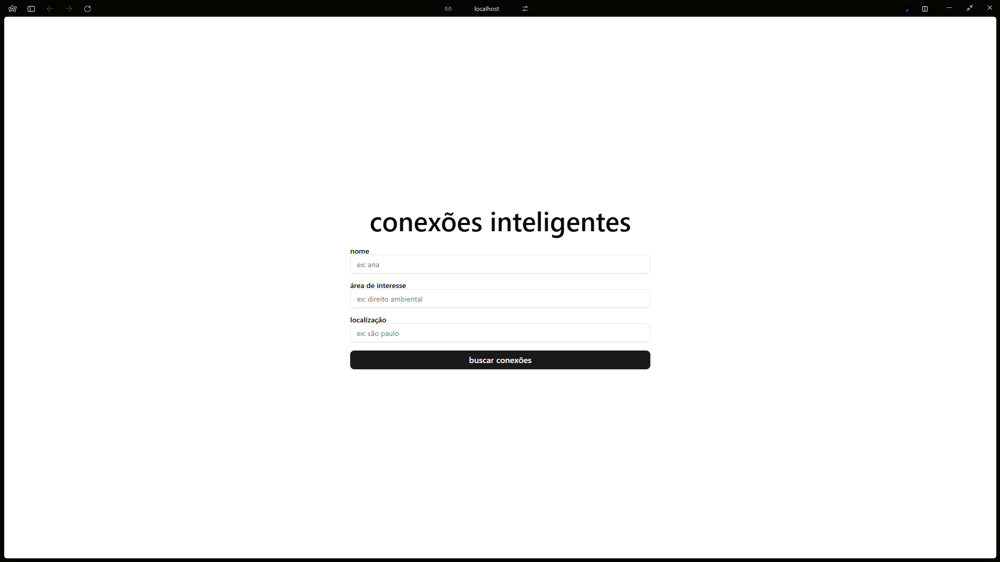
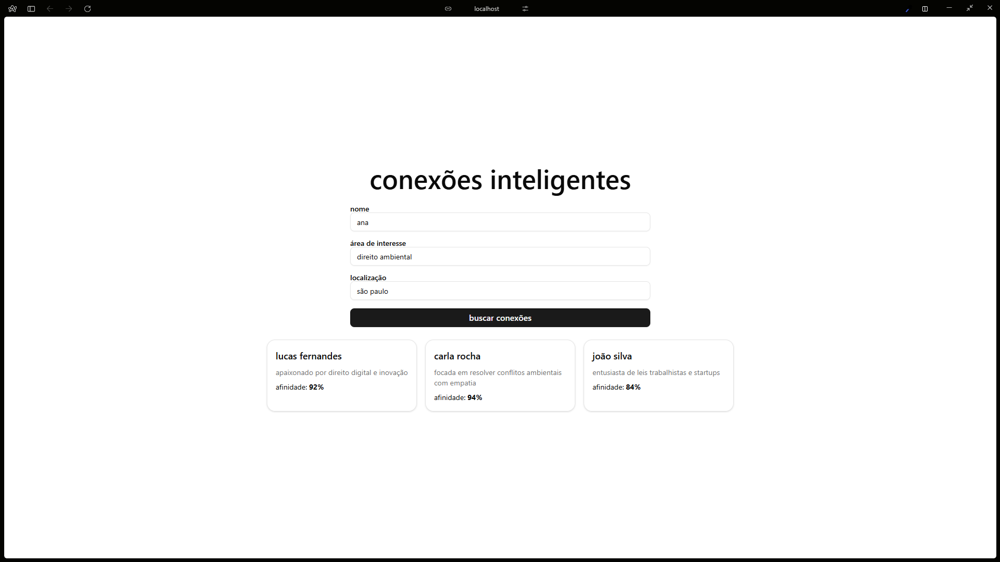

# Mini MVP – Matchmaking Inteligente Fictício 🧠

Desenvolvido como parte do processo seletivo para a vaga de **Desenvolvedor(a) Full Stack** na **Legal.ai**.

Este projeto propõe uma interface simples e funcional de matchmaking com uma inteligência artificial **simulada**, priorizando clareza no código, criatividade e uma boa experiência do usuário.

---

## 📸 Visualização

### Tela Principal


### Resultados do Match


---

## 🚀 Como Executar o Projeto

Siga os passos abaixo para rodar o projeto localmente:

1. Clone o repositório:
   ```bash
   git clone https://github.com/seu-usuario/legalai-mvp.git
   ```
2. Acesse o diretório do projeto:
   ```bash
   cd legalai-mvp
   ```
3. Instale as dependências:
   ```bash
   npm install
   ```
4. Inicie o servidor de desenvolvimento:
   ```bash
   npm run dev
   ```

---

## 🛠️ Tecnologias Utilizadas

- **React**: Biblioteca principal para construção da interface.
- **Vite**: Ferramenta de build para um desenvolvimento rápido.
- **Shadcn/UI**: Componentes de UI para um design limpo e responsivo.
- **React Hook Form**: Gerenciamento e validação de formulários.

---

## 🧠 Decisões de Desenvolvimento

- Utilizei **Shadcn/UI** para criar uma interface visualmente limpa e responsiva.
- Implementei um formulário simples com validação leve usando **React Hook Form**.
- Simulei a afinidade entre perfis com números aleatórios (60% a 95%).
- Renderizei perfis mockados dinamicamente após o envio do formulário.
- Escrevi o código com **TypeScript** mínimo, focando em clareza e simplicidade.

---

## ⏳ Melhorias com Mais Tempo

Se houvesse mais tempo, eu:
- Implementaria uma lógica de afinidade real, baseada nos dados fornecidos pelo usuário.
- Integraria um banco de dados como **Supabase** ou **Firebase** para persistência de dados.
- Adicionaria autenticação simples via **GitHub** ou **Google**.
- Incorporaria animações com **Framer Motion** para feedbacks visuais mais ricos.
- Criaria uma página de perfil detalhada para cada conexão.

---

## 📬 Contato

**Ryan Jesus**  
[LinkedIn](https://linkedin.com/in/euryanjesus)  
[Email](mailto:euryanjesus@gmail.com)